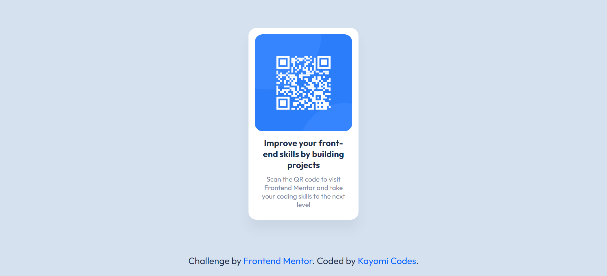

# Frontend Mentor - QR code component solution

This is a fully responsive attempt to the [QR code component challenge on Frontend Mentor](https://www.frontendmentor.io/challenges/qr-code-component-iux_sIO_H) with as few lines of code as possible.

## Table of contents

- [Overview](#overview)
  - [Result](#screenshot)
- [My process](#my-process)
  - [Built with](#built-with)
  - [What I learned](#what-i-learned)
  - [Useful resources](#useful-resources)
- [Author](#author)

## Overview

### Result

## My process

### Built with

- HTML5
- CSS3
- VS Code

### What I learned

With the help of Kevin Powell's videos on responsive design, I was able to redo this exercise using significantly fewer media queries! I learned to implement `min()`, `max()` and `clamp()`. The result is much cleaner and intuitive for the browser, as well as easier to read.

### Useful resources

- [3 modern CSS techniques for responsive design](https://youtu.be/VsNAuGkCpQU?si=_FupWyYNm_rf8FVC)
- [min(), max(), and clamp() are CSS magic!](https://youtu.be/U9VF-4euyRo?si=fEFThzCODsUpvnZI)

## Author

- Website - [Kayomi Codes](https://kayomi-codes.github.io/)
- Frontend Mentor - [@kayomi-codes](https://www.frontendmentor.io/profile/kayomi-codes)
- DEV Community - [@kayomi-codes](https://dev.to/kayomi-codes)
